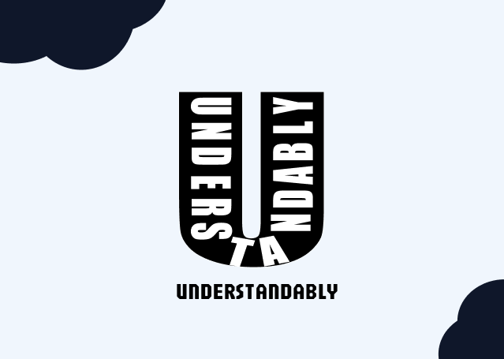
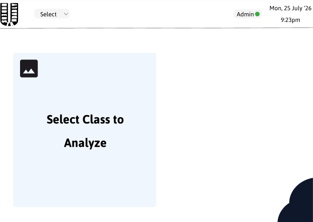
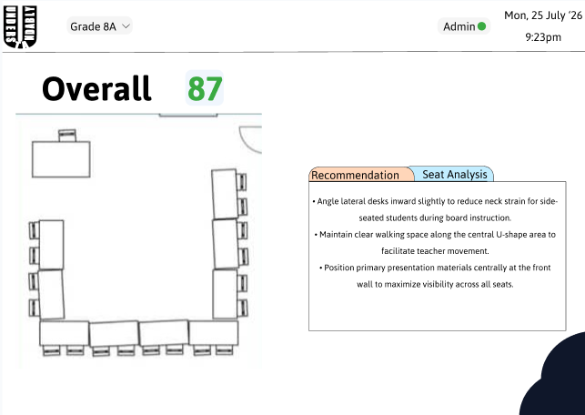
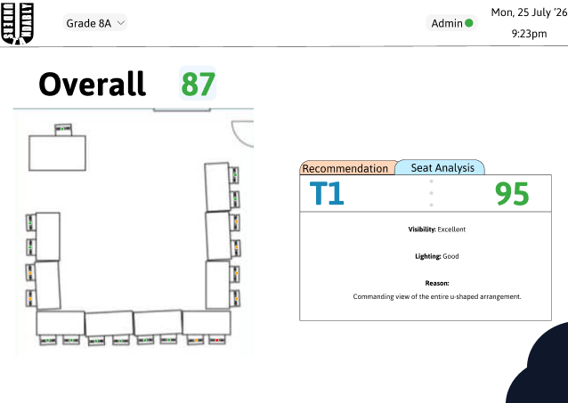
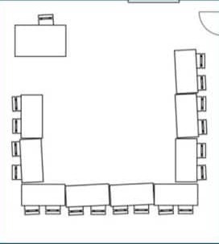
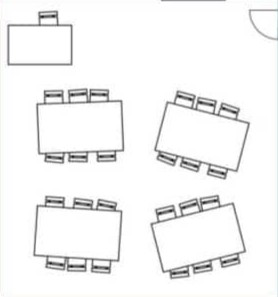
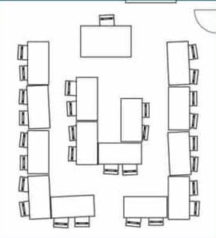
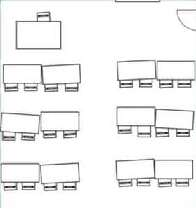

  

# Understandably
### AI-Powered Classroom Digital Twin
Understandably is an AI-powered digital classroom twin that analyzes classroom layouts, evaluates every seat, and provides intelligent recommendations to improve the learning environment. Designed for the Qutuhal InnovateX 2.0 2026.

## Key Features

- AI-powered classroom analysis
- Interactive digital classroom twin
- Seat-wise evaluation
- Overall classroom score
- AI-generated recommendations
- Specialized Seat Analysis
- Classroom-wise analysis
- Responsive web interface
- Powered by Google Gemini

## Technologies Used

| Technology | Purpose |
|------------|---------|
| HTML | Structure |
| CSS | Styling |
| JavaScript | Application Logic |
| INI | Configuration |
| Gemini API | AI Analysis |
| Figma | UI Design |

## Figma Wireframe
> The Figma wireframe is provided as a design reference. Minor differences may exist between the wireframe and the final MVP due to implementation improvements.

[Figma Design Link](https://www.figma.com/design/1t8Oimvoq4EYWGiT4yEw6O/Uderstandably?node-id=0-1&t=uqYCAN9N7HpnYp5C-1)

### Loader

### Dashboard

### Results(Recommendations)

### Results(Seat Analysis)

> The Bests feature was introduced after the Figma wireframe was completed and is therefore not reflected in the design.
## Demo Classrooms

## Project Files

- [index.html](Codec/index.html)
- [style.css](Codec/style.css)
- [script.js](Codec/script.js)
- [api.js](Codec/api.js)
- [config.ini](Codec/config.ini)
- [assets](Codec/assets)

## Live Prototype
[Prototype Link](https://understandably.netlify.app/)
> I kindly request the judges to be patient if the AI analysis does not complete successfully on the first attempt. Temporary failures may occur due to network connectivity, loading delays, or AI API rate limits. Please try again after a few moments, as these issues are external and are not caused by the application itself.

Also
> If you open the application directly using a file:/// URL (by double-clicking index.html), it will not function correctly due to browser security restrictions. Please run the project using a local web server (e.g., Live Server in VS Code or python -m http.server) and access it through http://localhost/....

### Usage

1. Launch the application.
2. Select a classroom.
3. Click **Analyze**.
4. Wait for the AI analysis.
5. View the classroom score.
6. Read the recommendations.
7. Click any seat to view its detailed analysis.
8. View the best seats for each category.

## License

This project was developed solely for the InnovateX Competition.

Developed by Divya Nebhnani

Version: 1.0 (MVP)

All rights reserved.
